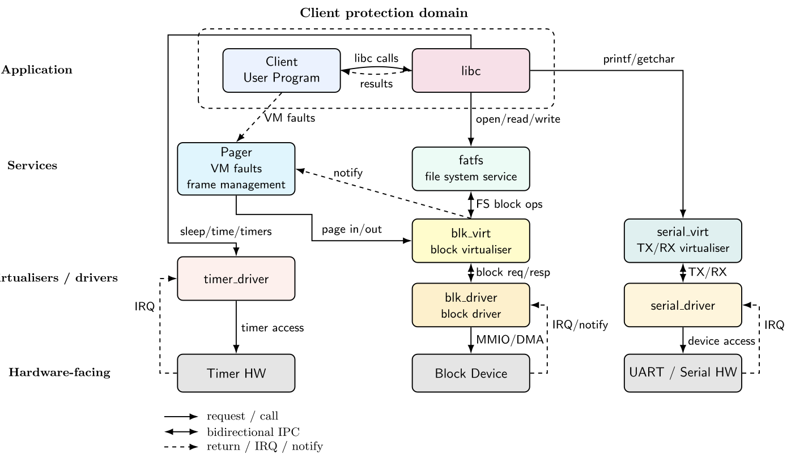

# Memory Pager for LionsOS
Minimal demand-paging service (`pager` PD) that backs the `client` PD on seL4/Microkit (AArch64) via fault handling, shadow 4-level page tables, CoW global zero page, and bump/slab allocators for frames and paging structures.

This pager is meant for benchmarking minor page faults of anonymous memory like in Figure 8 of the [HongMeng paper](https://www.usenix.org/system/files/osdi24-chen-haibo.pdf). It is also to be used to benchmark the address space copy semantics of `fork()` but this is WIP.
It can be used for real applications but should only really be used for a *static* system as frame objects and paging objects do not get untyped. 
<!-- TODO: write a quick description of the pager.
TODO: big caveats like only for aarch64, supports the maaxboard and qemu. -->

## 1. How to run
### 1.1 Dependencies
- [seL4](https://github.com/SEL4/sel4): specifically tag **16.0.0**
- [rust](https://github.com/au-ts/rust-sel4): specifically branch *carrells_demo*
- [Microkit](https://github.com/au-ts/microkit/tree/joshua/pager_component): specifically branch **joshua/pager_component**
- [microkit_sdf_gen](https://github.com/au-ts/microkit_sdf_gen/tree/joshua/pager_component): specifically branch **joshua/pager_component**
- [LionsOs](https://github.com/au-ts/lionsos/tree/joshua/pager_component): specifically branch **joshua/pager_component**

### 1.2 How to run examples/pager
The example implementation in examples/pager shows the pager running with a client. The client runs a microbenchmark measuring minor page faults.
1. Install [microkit_sdf_gen](https://github.com/au-ts/microkit_sdf_gen/tree/joshua/pager_component) by running the following:
```sh
python3 -m venv venv
./venv/bin/pip install .
```
2. Compile [Microkit](https://github.com/au-ts/microkit/tree/joshua/pager_component) for maaxboard and qemu_virt_aarch64 by running the following:
```sh
    # edit the path pointing to rust-seL4 first.
    python build_sdk.py --sel4=/path/to/seL4 --boards=qemu_virt_aarch64,maaxboard --configs=debug,benchmark --skip-docs --skip-tar
```
3. Download [LionsOs](https://github.com/au-ts/lionsos/tree/joshua/pager_component) submodules by running the following in the [LionsOs](https://github.com/au-ts/lionsos/tree/joshua/pager_component) directory:
```sh
git submodule update --init --recursive
```
4. Build and run the example:
```sh
cd /dir/to/lionos/examples/pager
```
For qemu:
```sh
cd /dir/to/lionos/examples/pager
#set environment variables
export MICROKIT_BOARD="qemu_virt_aarch64"
make qemu
```
For maaxboard:
```sh
export MICROKIT_BOARD="maaxboard"
make
# use the resulting build/loader.img to boot Maaxboard.
```
## 2. Components
<!--  -->

Note: paging in/out not implemented yet. Pager only deals with anonymous memory, no page cache implementation yet.

- **Client**
A protection domain (process) that is paged by the `pager`. It is configured as any
LionsOS protection domain; adding it to the pager with `pager_system.add_client()` is what
names the pager as its fault handler and leaves its stack unbacked so that it faults in.

- **Pager**
A LionsOS component that receives all remaining untyped memory after system initialisation.
When one of its clients takes a VM fault, the kernel delivers it to the pager's `fault()`
entry point, and the pager creates and maps intermediary paging structures and frames to
service it.

- **LionsOS LibC**
The LionsOS libC is how the client interfaces with the other operating system components like the file system, the serial device and timer (also networking but removed for this example). This is required at this stage as memory allocations (sys_mmap & sys_brk) are implemented as part of the libC, which is a per PD library. It is part of the client protection domain.

## 3. Implementation details
### 3.1 Source layout
The pager itself lives in `lionsos/components/pager/`, like any other LionsOS component.
Each module owns its own state and exposes it through the matching header in `include/`.

| File | Responsibility |
| --- | --- |
| `lions/pager/config.h` | The contract with sdfgen: `pager_server_config_t` (the CNode slots, the scratch and BootInfo regions, the per-client channel and fault ids) and `pager_client_config_t` (the channel the client's libc PPCs on). |
| `include/pager.h` | The contract with the Microkit tool: the symbols it patches in (`vspaces`, `elf_caps`, `elf_sizes`) and the slab sizes. |
| `src/pager.c` | The Microkit entry points only: `init()`, `notified()`, `fault()` and `protected()`. |
| `src/untyped.c` | Owns the untypeds left after initialisation; everything that retypes an object goes through `untyped_alloc()`. |
| `src/cspace.c` | Generic CSpace/untyped bookkeeping (`cnode_specs_t`) and `create_cap_rights()`. |
| `src/frame_table.c` | Folio metadata, the frame free list, the global zero page cap copies and the `frame_copies` CNode. |
| `src/page_table.c` | Shadow page tables: the intermediary paging structure free list, `make_page_table_entry()` and `unmap_range()`. |
| `src/proc.c` | The process table and `fork()`. |
| `src/mem.c` | The `brk`/`mmap`/`munmap`/`fork` PPCs from the client's libc. |
| `src/bitmap.c` | The block allocator `mem.c` hands out the client's mmap arena with. |

The example keeps only what is specific to it: `src/client.c`, which selects a benchmark
from `benchmarks/`, and `meta.py`.

### 3.2 System description (metaprogram)
The pager is created like any other LionsOS system:

```py
pager = ProtectionDomain("pager", "pager.elf", priority=198)
pager_system = LionsOs.Pager(sdf, pager)

client = ProtectionDomain("client", "client.elf", priority=1)
pager_system.add_client(client)

for pd in (..., pager, client, ...):
    sdf.add_pd(pd)

assert pager_system.connect()
assert pager_system.serialise_config(output_dir)
```

`add_client()` does three things: it creates the protected procedure call channel the
client's libc uses for `brk`/`mmap`/`munmap`/`fork`, it names the pager as the client's
fault handler, and it sets `backed=False` so the client's stack pages are left unmapped at
boot and fault in. `connect()` then creates everything that belongs to the pager itself --
the scratch memory, the BootInfo region and the CNodes below -- and records it all in the
`pager_server_config_t` that `serialise_config()` writes out.

The client is an ordinary top-level PD and must be passed to `sdf.add_pd()` like any other.

- **Fault routing:**
```xml
<protection_domain name="client" priority="1" backed="false"
                   fault_handler="pager" fault_id="0" />
```
`fault_handler` names the PD a protection domain's faults are delivered to, and `fault_id`
is the value that PD's `fault()` entry point receives to identify it. The pager is *not*
the client's parent, so the client is declared at the top level. sdfgen allocates each
client a `fault_id` equal to its index in the pager system, which is what lets the pager
use the value `fault()` hands it to index its per-client state directly.

- **BootInfo:** `connect()` creates a memory region with
`prefill_bootinfo="post_capdl_untypeds"`, which is what makes the Microkit tool write
metadata about the leftover untyped memory into it, and maps it into the pager. The pager
reads it through `pager_config.bootinfo.vaddr`.

- **CNodes:**
The pager receives its caps at runtime, so it needs somewhere to put them. Each CNode below
is declared once and mapped into a slot of the pager's root CSpace; the pager learns the
slots from `pager_config` and reaches them with `microkit_cspace_root_slot_to_cptr()`.

| Slot | CNode | `size_bits` | Holds |
| --- | --- | --- | --- |
| 1 | `untypeds` | 9 | All untyped memory left after initialisation. Declared with `post_capdl_untypeds=True`, which is what makes the Microkit tool fill it. |
| 2 | `frames` | 20 | Frames the pager retypes to satisfy faults. |
| 3 | `paging_structures` | 20 | Intermediary paging structures (PUD/PD/PT). |
| 4 | `zero_page_copies` | 20 | Copies of the global zero page cap, one per read-only mapping. |
| 5 | `process_cspaces` | 5 | The per-process CSpaces `fork()` creates. |
| 6 | `elf_caps` | 12 | The clients' ELF frames, filled in by the Microkit tool. The pager points the tool at it with the `elf_caps_cnode` attribute. |
| 7 | `frame_copies` | 20 | Copies of ordinary frame caps. A frame cap carries its own mapping, so a folio mapped into more than one VSpace needs one cap per mapping. |

Note that the Microkit tool separately hands the pager a VSpace cap per client, but those go
into the PD's *nested* Microkit CNode rather than the root CSpace above, so the two slot
numberings are independent and do not collide. The pager never names those slots -- it reads
the resulting cptrs out of the `vspaces` symbol the tool patches into `pager.elf`.

- **Scratch memory:** `connect()` also creates the memory region the shadow page tables and
folio metadata are built in, reachable as `pager_config.memory`.

### 3.3 [Microkit](https://github.com/au-ts/microkit) changes
- `fault_handler`/`fault_id` attributes on a protection domain, routing its faults to a PD
  that is not its parent.
- `elf_caps_cnode` attribute, naming the CNode a fault handler's clients' ELF frame caps are
  placed in. The tool patches `vspaces`, `elf_caps` and `elf_sizes` into the handler's ELF.
- Option to have unbacked stack pages for protection domains.

### 3.4 [sdfgen](https://github.com/au-ts/microkit_sdf_gen) changes
- `LionsOs.Pager(sdf, pager_pd)` with `add_client()`, `connect()` and `serialise_config()`.
- `backed=False` for protection domains.

## 4. Caveats
- No untyping of typed objects implemented yet: A system using the pager would only be able to dynamically create caps and paging structures.
- See 5. Future direction & WIP.
## 5. Future direction & WIP
- Memory-related syscalls: WIP - necessary for frees.
- Demand paging with page replacement algorithm.
- filesystem page cache: This would require extensive rework of the filesystem.
