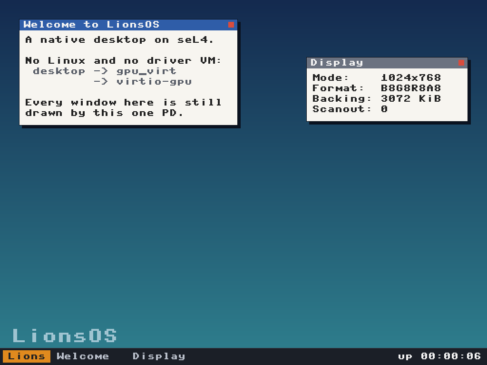

<!--
     Copyright 2026, LionsOS Contributors
     SPDX-License-Identifier: CC-BY-SA-4.0
-->

# Desktop

The beginnings of a native LionsOS desktop. Unlike the `kitty` example, which
drives the display through a Linux driver VM, graphics here go straight
through sDDF's GPU device class:

```
desktop  ->  gpu_virt  ->  gpu_driver  ->  virtio-gpu (QEMU)
   |
   +------>  timer_driver
```



The `desktop` protection domain software-renders into a framebuffer that lives
in its GPU data region, scans it out as a 2D resource and then redraws the
taskbar clock once a second. Only the damaged rows are transferred and flushed
to the device on each tick.

This is milestone 2 of the plan below: one native client drawing to the
screen. The windows are placeholders drawn by the desktop PD itself.

## Building

Only `qemu_virt_aarch64` is supported, since it is the only board with an sDDF
GPU driver.

```sh
make MICROKIT_SDK=/path/to/sdk
```

The generated system image is `build/desktop.img`. The system description is
generated by `meta.py` with sdfgen, like the other examples.

## Running

```sh
make MICROKIT_SDK=/path/to/sdk qemu
```

This opens a QEMU window with a 1024x768 display. The mode can be changed with
`DESKTOP_XRES` and `DESKTOP_YRES`; the framebuffer must fit in the 4 MiB GPU
data region (`GPU_DATA_REGION_SIZE_CLI0` in `include/gpu_config.h`, and the
matching size in `meta.py`).

## Layout

| Path | Contents |
|---|---|
| `src/desktop.c` | The desktop PD: GPU setup, drawing, clock and damage updates |
| `src/gfx.[ch]` | Minimal clipped software renderer for BGRA surfaces |
| `src/font_petme128_8x8.h` | 8x8 bitmap font vendored from MicroPython (MIT) |
| `meta.py` | System description: GPU driver, virtualiser, desktop and timer |
| `include/gpu_config.h` | GPU class configuration, derived from sDDF's GPU example |
| `include/compat/` | Shims that keep the pinned sDDF GPU components building |

## sDDF compatibility shims

sDDF's GPU driver and virtualiser have not kept up with two refactors elsewhere
in sDDF and no longer build on their own, both at the version LionsOS pins and
on sDDF `main`:

* `ff465ea` ("virtio: make transport layer agnostic") removed
  `<sddf/virtio/virtio.h>` and `<sddf/virtio/virtio_queue.h>`, which the GPU
  driver still includes.
* `b76617b` ("Fixup ialloc implmenetation") removed
  `ialloc_init_with_offset()`, which the GPU virtualiser uses to keep resource
  id 0 reserved.

The headers in `include/compat/` provide these on top of the current APIs so
that the example can use the sDDF sources unmodified. They should be deleted
once the GPU components are ported upstream.

Two further notes for the upstream GPU class:

* The virtualiser bounds-checks and cleans the cache for `TRANSFER_TO_2D` as if
  the rectangle were contiguous in memory (`width * height * bpp` bytes from
  `mem_offset`). That is only correct for full-width transfers, so the desktop
  always transfers full-width row bands.
* The driver needs the physical addresses of its DMA regions and of each
  client's data region. sdfgen 0.35 has no GPU class, so `meta.py` describes
  these PDs by hand and adds Microkit `region_paddr` setvars to its output.

## Roadmap

1. Pixels on screen through the native sDDF GPU stack (done)
2. A LionsOS client drawing natively, built in CI (this example)
3. Input: a virtio-input driver and an input virtualiser in the sDDF style
4. A compositor with a fixed number of client slots, each with its own surface
   region, plus focus and damage tracking
5. A widget toolkit (e.g. LVGL or microui) and a shell (taskbar, launcher)
6. Dynamic applications as WebAssembly or MicroPython loaded from a file system
7. Real hardware, which needs a native display driver
